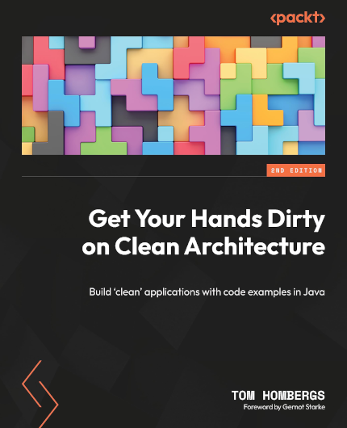
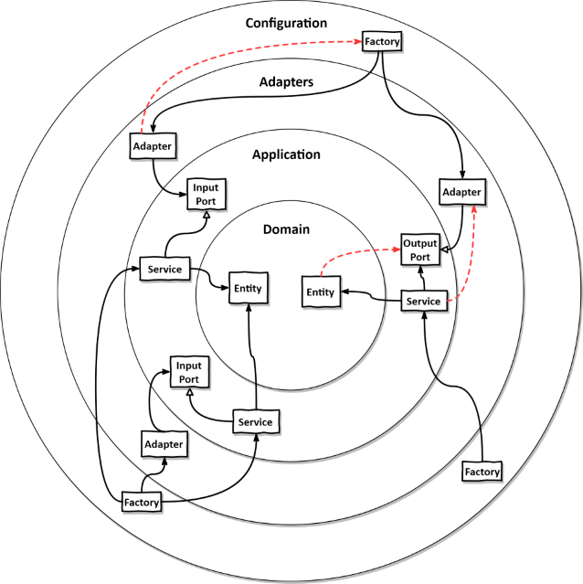

[](https://dl.circleci.com/status-badge/redirect/gh/koshuang/laravel-hexagonal-architecture/tree/main)


# laravel-hexagonal-architecture

This is an implementation of Hexagonal Architecture for Laravel 10. The example is based on https://github.com/thombergs/buckpal which author of the book [Get Your Hands Dirty on Clean Architecture: A hands-on guide to creating clean web applications with code examples in Java](https://pubhtml5.com/dtiq/edqp).

YouTube Talk: https://www.youtube.com/watch?v=cPH5AiqLQTo&t=1684s
    15:53 dependency inversion principle (DIP)
    16:11 left-side: database driven design
        16:17 Service has dependency on the persistence layer
    16:55 right-side: Entity is moved up into the domain layer
        17:09 Repository interface
        17:18 the persistence layer simply implement the repository interface
    17:38 meaning: we can choose the direction of any code dependency

Slides: https://speakerdeck.com/thombergs/o-2019
Slides: https://speakerdeck.com/thombergs/o-2019

## Clean Architecture with Spring (Spring I/O 2019)

> Buzzwords like “Clean Architecture” and “Hexagonal Architecture” have been around for quite some time now. But have you actually seen an application built with one of these paradigms? How do we actually implement such an architecture in a way that the software we create stays flexible and maintainable?

> This talk presents the concepts and reasoning behind the buzzwords “Clean Architecture” and “Hexagonal Architecture” and translates them into actual code. Going through an example web application based on Java and Spring, we’ll discuss the full stack ranging from the web layer to the persistence layer. How should we structure our application? Where does the input validation code belong? How do I access my domain logic? How can I let my bounded contexts communicate cleanly? And how does Spring help with all of this? These questions and more will be answered.

## Folder structure

```
Modules
└── Account
    ├── Application
    ├── Domain
    │   ├── Entities
    │   └── ValueObjects
    ├── Infrastructure
    │   ├── Adapter
    │   │   ├── In
    │   │   │   ├── Console
    │   │   │   └── Web
    │   │   │       ├── Http
    │   │   │       │   ├── Controllers
    │   │   │       │   ├── Middleware
    │   │   │       │   └── Requests
    │   │   │       ├── Resources
    │   │   │       │   ├── assets
    │   │   │       │   ├── lang
    │   │   │       │   └── views
    │   │   │       └── Routes
    │   │   └── Out
    │   │       └── Persistence
    │   │           ├── Database
    │   │           │   ├── Factories
    │   │           │   ├── Migrations
    │   │           │   └── Seeders
    │   │           └── ElequentModels (Original Entities folder from Laravel)
    │   ├── Config
    │   └── Providers
    └── Tests
        ├── Common
        ├── Feature
        └── Unit
            └── Domain
                └── Entities
```

## What have I done?

- Run StyleCI, Larastan on CircleCI
- Use [laravel-modules](https://github.com/nWidart/laravel-modules) package to create a `Account` module. The Account module should reflect to BoundedContext for DDD.
- Map Laravel boilerplate into Infrastructure
- Use TDD to gradually port code from https://github.com/thombergs/buckpal
    - Add test for Domain Layer of Account
        - calculate balance
        - withdraw


## Get the print book

[](https://www.amazon.com/Your-Hands-Dirty-Clean-Architecture/dp/180512837X?keywords=get+your+hands+dirty+on+clean+architecture&amp;qid=1689324075&amp;sprefix=Get+Your+Hands+Dirty+on+Clean+,aps,424&amp;sr=8-2&_encoding=UTF8&tag=reflectorin0c-20&linkCode=ur2&linkId=c04a12e6dd6d399747b0cdce328650a5&camp=1789&creative=9325)

## Companion Articles

* [Hexagonal Architecture with Java and Spring](https://reflectoring.io/spring-hexagonal/)
* [Building a Multi-Module Spring Boot Application with Gradle](https://reflectoring.io/spring-boot-gradle-multi-module/)

## About the book
### All About Hexagonal Architecture

* Learn the concepts behind "Clean Architecture" and "Hexagonal Architecture".
* Explore a hands-on approach of implementing a Hexagonal architecture with example code [on GitHub](https://github.com/thombergs/buckpal).
* Develop your domain code independent of database or web concerns.





## Contributing

Feel free to contribute :)

## License

The example is open-sourced software licensed under the [MIT license](https://opensource.org/licenses/MIT).

## Fontes:
- https://www.linkedin.com/pulse/explorando-arquitetura-hexagonal-em-laravel-uma-de-design-bernardes/
- https://medium.com/@osmarrod18/mastering-hexagonal-architecture-in-laravel-a-dive-into-domain-driven-design-8d7c65777252
- https://fideloper.com/hexagonal-architecture
- https://github.com/thombergs/buckpal
- https://www.linkedin.com/feed/update/urn:li:activity:7112540255005675520/
- https://reflectoring.io/book/
